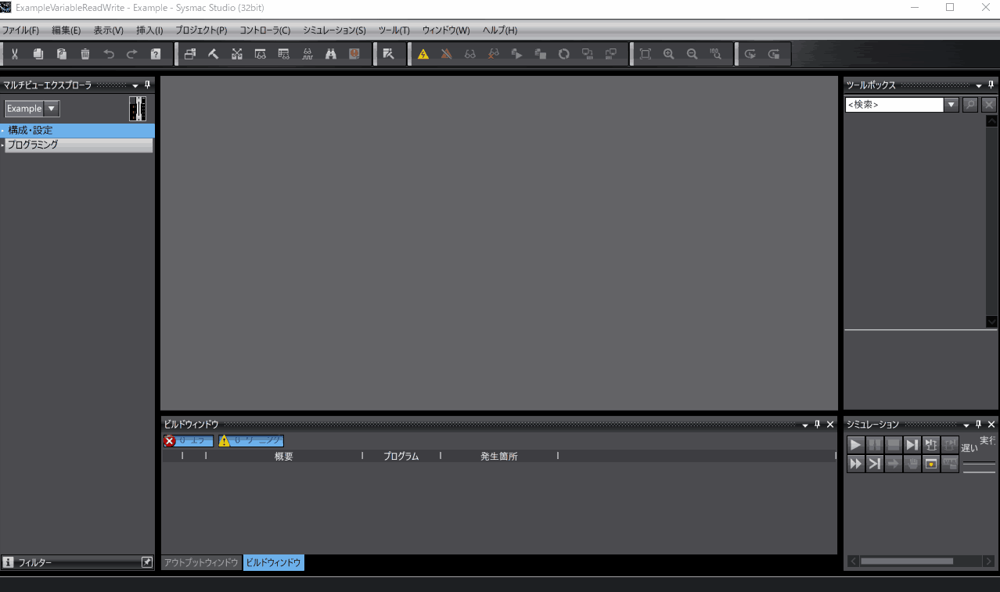
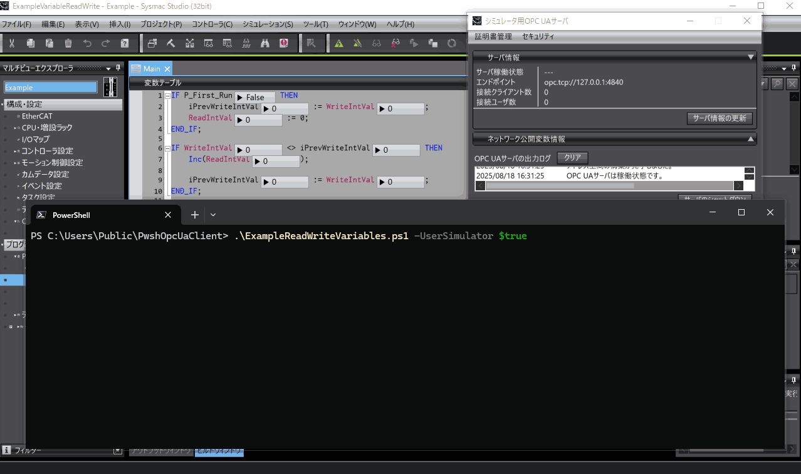
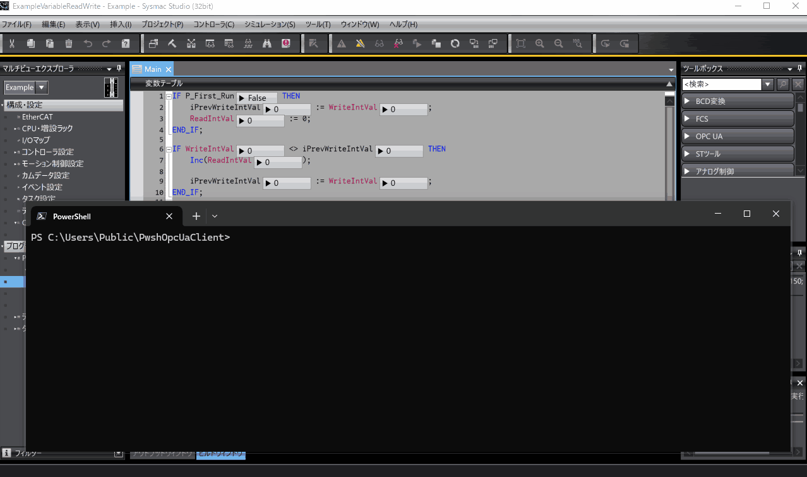

# PwshOpcUaClient
**PwshOpcUaClient** is an OPC UA client for **PowerShell** that uses the OPC Foundation's **UA.NETStandard** library.
It's designed to be a self-contained, instant-use OPC UA client that runs directly from its own directory.
This tool is ideal for verifying OPC UA server operations, performing basic monitoring, and creating mock OPC UA clients.
There's some additional information in the Japanese article, **"PowerShellでOPC UAクライアントを作る"**, available at [https://zenn.dev/kitam/articles/143188e5f53d03](https://zenn.dev/kitam/articles/143188e5f53d03).

## System Requirements
To use PwshOpcUaClient, you need the following:

| Item | Requirement |
|:---|:---|
| PowerShell | 7 or later |

The specific UA.NETStandard packages required can be found in the **`setup.ps1`** script.

## Development Environment
PwshOpcUaClient is tested in the following environment:

| Item | Version |
|:---|:---|
| PowerShell | 7.5.2 |

## PwshOpcUaClient Components
PwshOpcUaClient consists of the following files, which must be in the same directory to function correctly:

* **`PwshOpcUaClient.ps1`**   
   This is the core script. You load it into a PowerShell session using **dot-sourcing**.
* **`LoadAssembly.ps1`**   
   This script loads the necessary assemblies into the current PowerShell session by running `Add-Type`.   
   If you encounter .NET version issues, you may need to modify this script to load a different assembly.
* **`setup.ps1`**   
   This script handles the acquisition and placement of assemblies.   
   It downloads `Nuget.exe` and retrieves the required assemblies.   
   You can modify this simple script as needed.

The default client's directory structure is designed for relative paths,
so you can run it from any location as long as the relative file paths are maintained.
The paths used by the default client are located under the PwshOpcUaClient directory, including the UA.NETStandard assemblies.

Below is the default directory structure for PwshOpcUaClient:

```
root
├── PwshOpcUaClient.ps1
├── LoadAssembly.ps1
├── setup.ps1
├── libs
├── logs
└── pki
    ├── issuer
    |   └── certs
    ├── userIssuer
    |   └── certs
    ├── trustedUser
    |   └── certs
    ├── httpsIssuer
    |   └── certs
    ├── trustedHttps
    |   └── certs
    ├── own
    |   ├── certs
    |   └── privates
    ├── rejected
    |   └── certs
    └── trusted
        └── certs
```

* **`libs`**: Stores the UA.NETStandard assemblies.
* **`logs`**: Stores log files.
* **`pki`**: This is where certificates and related files are stored. The specific subdirectories handle different types of certificates:
* **`pki/issuer/certs`**: For issuer certificates.   
* **`pki/userIssuer/certs`**: For additional user issuer certificates.
* **`pki/trustedUser/certs`**: For trusted user certificates.
* **`pki/httpsIssuer/certs`**: For additional HTTPS issuer certificates.
* **`pki/trustedHttps/certs`**: For trusted HTTPS certificates.
* **`pki/own/certs`**: For client certificates (`.der` files), including those generated by PwshOpcUaClient.
* **`pki/own/privates`**: For client PFX files, including those generated by PwshOpcUaClient.
* **`pki/rejected/certs`**: Stores rejected server certificates.
* **`pki/trusted/certs`**: Stores trusted certificates.

The specifics of this structure depend on the **UA.NETStandard** library.
CRLs (Certificate Revocation Lists) should be placed in a subdirectory named **`crl`** within each store.
Windows also supports `X509Store` if you need it.
For more details, refer to the [UA.NETStandard documentation](https://www.google.com/search?q=https://github.com/OPCFoundation/UA-.NETStandard/blob/master/Docs/Certificates.md).

## How to Use PwshOpcUaClient
Follow these steps to get started:

1. **Place the PwshOpcUaClient files in a folder.**
2. **Run `setup.ps1`**.
3. **Dot-source `PwshOpcUaClient.ps1`** in your script to load the functions.

UA.NETStandard will automatically create any necessary certificates and directories.
If you need to specify a particular certificate, you can modify `PwshOpcUaClient.ps1` or use a configuration file (`*.Config.xml`).

If the UA.NETStandard assemblies, which are validly signed, fail to run, check your **PowerShell execution policy**.

When you establish a session or use signing/encryption for message exchange,
both the server and the client may reject certificates.
You can resolve this by trusting the rejected certificates,
which will prevent them from being rejected in future connections.

  * **If PwshOpcUaClient rejects a server certificate**: Move the server certificate from **`pki/rejected/certs`** to **`pki/trusted/certs`**.
  * **If the server rejects a client certificate**: Follow the server's procedure for trusting certificates. The required client certificate will be located in **`pki/own/certs`**.

## Using the Example Scripts
The example script, **`examples/ExampleReadWrite.ps1`**, connects to an OPC UA server (either Sysmac Studio's simulator or a physical controller) to read and write values.
The tested environment is:

| Item | Version |
|:---|:---|
| Sysmac Studio | Ver. 1.63 |
| Controller | NX102-9000 Ver. 1.64 HW Rev.A |

The example script uses paths configured to match the repository's directory structure.
If you change the path to PwshOpcUaClient, you'll need to update the part of the script that loads it.

### Using the Simulator OPC UA Server
This guide covers connecting to the OPC UA server included with Sysmac Studio Ver. 1.62 or later.
For more details, refer to the [manual](https://www.google.com/search?q=https://www.fa.omron.co.jp/data_pdf/mnu/sbcd-374p_nj501_nx.pdf%3Fid%3D3705).

1. **Run `setup.ps1` inside the PwshOpcUaClient folder.**
2. **Open the example project (`examples/ExampleReadWrite.smc2`) in Sysmac Studio and start the simulator.**
3. **Start and configure the simulator's OPC UA server.**   
   Follow the steps shown in the GIF to start the server and configure its settings.

   

4. **Run the script.**   
   With the OPC UA server running, execute the following command in PowerShell:

   ```powershell
   ./ExampleVariableReadWrite.ps1 -Interval 0.01
   ```

   The script will repeatedly read and write values.
   Due to the simulator's slower execution cycle, high-frequency reads and writes can cause value discrepancies.

   

### Using a Controller's OPC UA Server
This guide covers connecting to a physical controller's OPC UA server.
For more information, see the [manual](https://www.google.com/search?q=https://www.fa.omron.co.jp/data_pdf/mnu/sbcd-374p_nj501_nx.pdf%3Fid%3D3705).

1. **Run `setup.ps1` inside the PwshOpcUaClient folder.**
2. **Open the example project (`examples/ExampleReadWrite.smc2`) in Sysmac Studio and adjust the configuration to match your controller.**
3. **Configure the controller's OPC UA server.**   
   Connect to the controller with Sysmac Studio and configure the server as shown in the GIF.
   After setting up security, you may need to attempt an initial connection to trigger the server to reject the client's certificate,
   which you can then trust and move to the trusted list.

   

4. **Run the script.**   
   Replace `YOUR_DEVICE_ADDR` with your controller's IP address and execute the command in PowerShell:

   ```powershell
   ./ExampleVariableReadWrite.ps1 -UseSimulator $false -ServerUrl YOUR_DEVICE_ADDR -Interval 0.01
   ```

   The script will begin repeatedly reading and writing values. Unlike the simulator, the controller's program operates at a fixed cycle, so value discrepancies are unlikely.

   

## License
The components of PwshOpcUaClient that directly use UA.NETStandard are licensed under **GPLv2**.
All other components are licensed under the **MIT License**.
