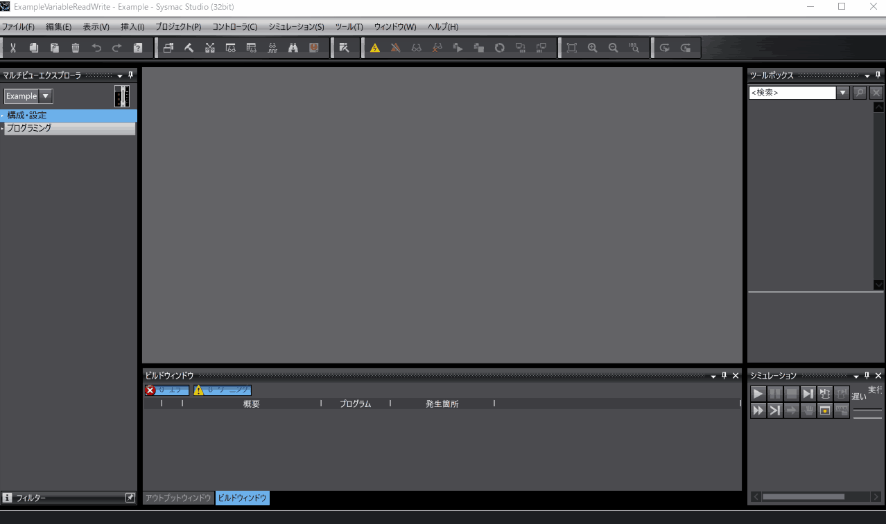
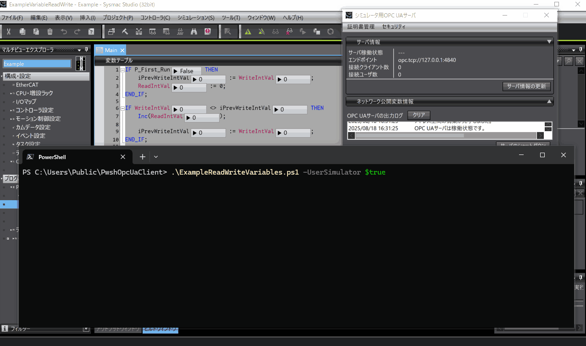
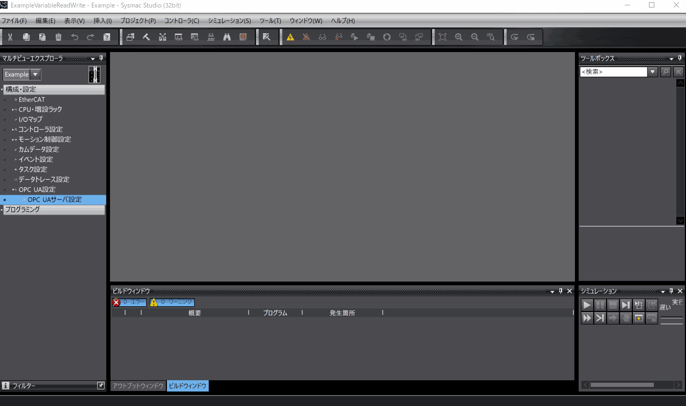
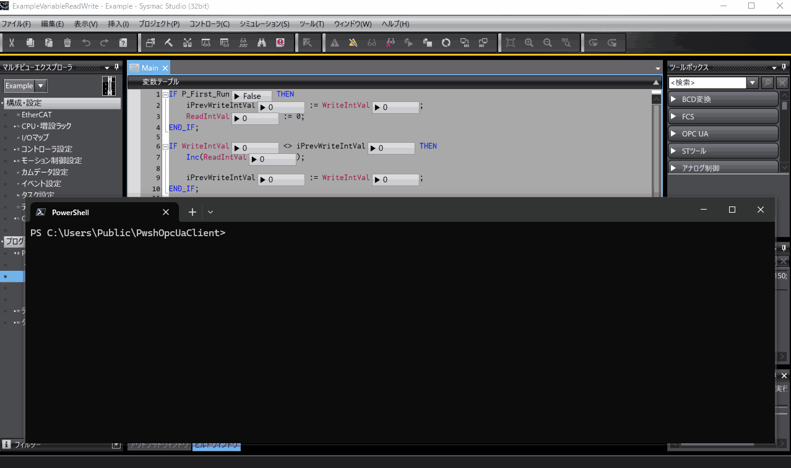

# PwshOpcUaClient
PwshOpcUaClientは、OPC Foundationの[UA.NETStandard](https://github.com/OPCFoundation/UA-.NETStandard)を使用したPowerShell用のOPC UAクライアントです。
PwshOpcUaClientは、スクリプトを配置したディレクトリで完結、かつ、インスタントに使えるOPC UAクライアントです。
OPC UAサーバの動作確認や軽微なモニタリング、OPC UAクライアントモックの作成に適しています。

## 使用環境
PwshOpcUaClientの使用には、以下が必要です。

| Item          | Requirement |
| :------------ | :---------- |
| PowerShell   | 7以降    |

UA.NETStandardのパッケージは、`setup.ps1`で確認できます。

## 構築環境
PwshOpcUaClientは、以下の環境で構築しています。

| Item            | Version              |
| :-------------- | :------------------- |
| PowerShell     | 7.5.2  |

## PwshOpcUaClientの構成
PwshOpcUaClientは、以下で構成します。

* **PwshOpcUaClient.ps1**   
   PwshOpcUaClient本体です。
   PowerShellセッションにロードして使用します。
   
* **LoadAssembly.ps1**   
   アセンブリを現在のPowerShellセッションにロードします。
   Add-Typeを実行します。.NETのバージョンに問題がある場合、スクリプトを修正して読み込むアセンブリを変更します。

* **setup.ps1**   
   アセンブリの取得と配置をします。
   Nuget.exeをダウンロードし、必要なアセンブリの取得と配置をします。
   簡素なスクリプトなので必要に応じて修正します。

PwshOpcUaClientは、これらが同一ディレクトリにあるとき正常に動作します。
PwshOpcUaClientのデフォルトクライアントは、構成ファイル間の相対位置が正しければ実行時のロケーションは任意です。
デフォルトクライアントが使用するパスはPwshOpcUAのディレクトリ下に配置します。
また、UA.NETStandardのアセンブリもPwshOpcUaClientのディレクトリ下に配置します。

PwshOpcUaClientのデフォルトクライアントのディレクトリ構造は以下です。

```
root
├── PwshOpcUaClient.ps1
├── LoadAssembly.ps1
├── setup.ps1
├── libs
├── logs
└── pki
    ├── issuer
    |   └── certs
    ├── userIssuer
    |   └── certs
    ├── trustedUser
    |   └── certs
    ├── httpsIssuer
    |   └── certs
    ├── trustedHttps
    |   └── certs
    ├── own
    |   ├── certs
    |   └── privates
    ├── rejected
    |   └── certs
    └── trusted
        └── certs
```

* **libs**   
   UA.NETStandardのアセンブリを配置します。
   LoadAssembly.ps1は、Nugetで取得したディレクトリ構造に対して読み込み処理を実行します。
* **logs**   
   ログを格納します。
* **pki/issuer/certs**   
   発行者証明書を配置します。
* **pki/userIssuer/certs**   
   追加のユーザー発行者証明書を配置します。
* **pki/trustedUser/certs**   
   信頼するユーザーの証明書を配置します。
* **pki/httpsIssuer/certs**   
   HTTPS接続時の追加の発行者証明書を配置します。
* **pki/trustedHttps/certs**   
   HTTPS接続時に信頼する証明書を配置します。
* **pki/own/certs**   
   クライアント証明書(.der)を配置します。
   PwshOpcUaClientが生成した証明書もここに配置します。
* **pki/own/privates**   
   クライアントが使用するPFXファイルを配置します。
   PwshOpcUaClientが生成したPFXファイルもここに配置します。
* **pki/rejected/certs**   
   拒否したサーバ証明書を格納します。
* **pki/trusted/certs**   
   信頼する証明書を配置します。

これらの構造の詳細は、UA.NETStandardに依存します。
CRLは、各ストアの`crl`という名称のサブディレクトリに配置するようです。
WindowsではX509Storeをサポートしているので、必要であれば使用できます。
詳細は[ドキュメント](https://github.com/OPCFoundation/UA-.NETStandard/blob/master/Docs/Certificates.md)を確認してください。

## PwshOpcUaClientの使用手順
PwshOpcUaClientは、以下の手順で使用します。

1. **適当なフォルダにPwshOpcUaClientの構成物を配置**
2. **`setup.ps1`を実行**
3. **PwshOpcUaClientを使用するスクリプトで`PwshOpcUaClient.ps1`をドットソースで読み込む**

PwshOpcUaClientが必要とする証明書とディレクトリは、UA.NETStandardによって適時作成されます。
使用する証明書を指定する場合、`PwshOpcUaClient.ps1`を証明書の内容に合わせて修正するか、構成ファイル(\*.Config.xml)を配置し、PwshOpcUaClientを構成ファイルで構築します。
構成ファイルについてのドキュメントは見当たらないのでUA.NETStandardのサンプルコードやライブラリのコードを確認します。

UA.NETStandardのアセンブリには有効な署名がされていますが、実行できない場合、PowerShellの実行ポリシーを確認します。

サーバとのセッション確立時や、メッセージ交換に署名または、署名と暗号化を使用するとサーバ、クライアントそれぞれが証明書を拒否する可能性があります。
いずれも拒否した証明書を信頼することで、次回の接続から拒否しなくなります。
証明書に問題が無ければ、以下の操作を行います。

* **PwshOpcUaClientがサーバ証明書を拒否したとき**  
   サーバ証明書が意図したものであれば、`pki/rejected/certs`に格納されたサーバ証明書を`pki/trusted/certs`に移動します。
* **サーバがクライアント証明書を拒否したとき**   
   サーバで拒否した証明書を信頼する手順があれば、それに従います。
   クライアント証明書が必要であれば、`pki/own/certs`内の証明書を使用します。

## 例示スクリプトの使用手順
例示スクリプト(`examples/ExampleReadWrite.ps1`)は、PwshOpcUaClientを使用してSysmac Studioのシミュレータ用OPC UAサーバまたは、コントローラのOPC UAサーバに接続して値の読み書きをします。
動作を確認した環境は、以下です。

| Item          | Version     |
| :------------ | :---------- |
| Sysmac Studio | Ver.1.63    |
| Controller    | NX102-9000 Ver1.64 HW Rev.A |

例示はリポジトリのディレクトリ構造に合わせてパス構成をしています。
PwshOpcUaClientへのパスを変更する場合、PwshOpcUaClientを読み込んでいる箇所を変更します。

### シミュレータ用OPC UAサーバでの使用手順
Sysmac Studio Ver.1.62以降に付属しているシミュレータ用OPC UAサーバに接続します。
シミュレータ用OPC UAサーバの詳細は[マニュアル](https://www.fa.omron.co.jp/data_pdf/mnu/sbcd-374p_nj501_nx.pdf?id=3705)を参照してください。

手順は以下です。

1. **PwshOpcUaClientの`setup.ps1`を実行する**

2. **Sysmac Stuidoで例示プロジェクト(`examples/ExampleReadWrite.smc2`)を開きシミュレータを起動**

3. **シミュレータ用OPC UAサーバの起動と設定**   
   以下のように操作してOPC UAサーバを起動し設定します。
   

4. **スクリプトの実行**   
   OPC UAサーバが起動した状態で以下をPowerShellで実行します。

   ```powershell
   ./ExampleVariableReadWrite.ps1 -Interval 0.01
   ```

   OPC UAサーバに接続すると以下のように値の読み書きを繰り返します。
   シミュレータのプログラム実行サイクルは実時間に対してのんびりです。
   そのため、OPC UAで高頻度に読み書きをすると1サイクル中に複数回の読み書きを行うことになります。
   その結果として値にズレが生じます。
   

### コントローラのOPC UAサーバでの使用手順
コントローラのOPC UAサーバに接続します。
コントローラのOPC UAサーバの詳細は[マニュアル](https://www.fa.omron.co.jp/data_pdf/mnu/sbcd-374p_nj501_nx.pdf?id=3705)を参照してください。

手順は以下です。

1. **PwshOpcUaClientの`setup.ps1`を実行する**

2. **Sysmac Stuidoで例示プロジェクト(`examples/ExampleReadWrite.smc2`)を開き構成を使用環境に合わせる**

3. **コントローラのOPC UAサーバの設定**   
   Sysmac Studioでコントローラに接続し、以下のように操作してOPC UAサーバを設定します。
   セキュリティ設定を行ったら、PwshOpcUaClientのクライアント証明書を信頼するために一度アクセスして拒否させた後、信頼リストに移動しています。
   

4. **スクリプトの実行**   
   以下の`YOUR_DEVICE_ADDR`をコントローラのアドレスに置き換え、PowerShellで実行します。

   ```powershell
   ./ExampleVariableReadWrite.ps1 -UseSimulator $false -ServerUrl YOUR_DEVICE_ADDR -Interval 0.01
   ```

   OPC UAサーバに接続すると以下のように値の読み書きを繰り返します。
   コントローラはプログラムが指定したサイクルで動作するので、よほどのことをしない限り値にズレは生じません。
   

## ライセンスについて
UA.NETStandardを直接に使用するPwshOpcUaClientの構成物はGPLv2ライセンスです。
その他は、MITライセンスです。
